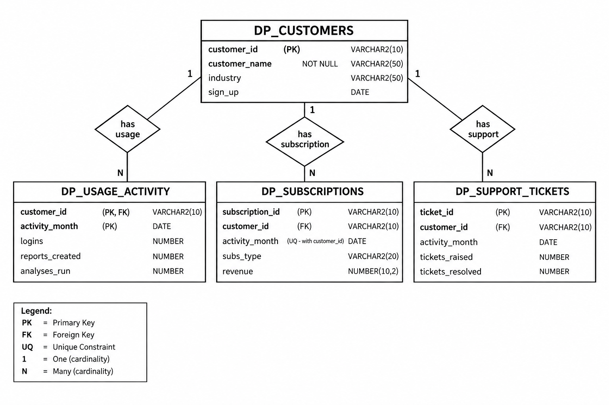

# DataPulse – SQL Analytics Project

## 1. Project Overview

DataPulse is a fictional AI analytics startup that helps businesses monitor operations and make data-driven decisions.

The customer base is growing, but the company does not clearly understand whether all customers are receiving consistent value from the platform.

Some customers are highly active and continue using the platform, while others show declining usage. The company also wants to understand how customer usage relates to subscription revenue, subscription plans, and support activity.

This project uses SQL to investigate these business patterns and identify useful insights.

---

# 2. Business Problem

The main business problem is:

> **DataPulse needs to understand customer engagement, changes in usage over time, and customer value so that it can identify important business patterns and possible warning signals.**

The analysis focuses on:

* Customer usage and engagement
* Changes in customer usage over time
* Subscription revenue
* Subscription plan differences
* Support activity around declining customers

---

# 3. Database Design

The database contains four main tables:

1. `DP_CUSTOMERS`
2. `DP_USAGE_ACTIVITY`
3. `DP_SUBSCRIPTIONS`
4. `DP_SUPPORT_TICKETS`

Each table represents a different business area.

| Table                | Purpose                                             |
| -------------------- | --------------------------------------------------- |
| `DP_CUSTOMERS`       | Stores customer information                         |
| `DP_USAGE_ACTIVITY`  | Stores monthly customer usage                       |
| `DP_SUBSCRIPTIONS`   | Stores monthly subscription and revenue information |
| `DP_SUPPORT_TICKETS` | Stores monthly customer support activity            |

Separating these areas into different tables makes it possible to analyze relationships between customers, usage, revenue, subscription plans, and support activity.

---

# 4. Tables and Columns

## 4.1 DP_CUSTOMERS

This is the main customer table.

| Column          | Data Type    | Description                        |
| --------------- | ------------ | ---------------------------------- |
| `CUSTOMER_ID`   | VARCHAR2(10) | Unique ID of the customer          |
| `CUSTOMER_NAME` | VARCHAR2(50) | Name of the customer               |
| `INDUSTRY`      | VARCHAR2(50) | Customer industry                  |
| `SIGN_UP`       | DATE         | Date the customer joined DataPulse |

Primary Key:

`CUSTOMER_ID`

---

## 4.2 DP_USAGE_ACTIVITY

This table stores monthly usage activity for each customer.

| Column            | Data Type    | Description                  |
| ----------------- | ------------ | ---------------------------- |
| `CUSTOMER_ID`     | VARCHAR2(10) | Customer identifier          |
| `ACTIVITY_MONTH`  | DATE         | Month of the activity        |
| `LOGINS`          | NUMBER       | Number of customer logins    |
| `REPORTS_CREATED` | NUMBER       | Number of reports created    |
| `ANALYSES_RUN`    | NUMBER       | Number of analyses performed |

Primary Key:

`CUSTOMER_ID + ACTIVITY_MONTH`

The combination is used because one customer can have multiple monthly records.

Foreign Key:

`CUSTOMER_ID` references `DP_CUSTOMERS(CUSTOMER_ID)`

---

## 4.3 DP_SUBSCRIPTIONS

This table stores subscription information and monthly revenue.

| Column            | Data Type    | Description                        |
| ----------------- | ------------ | ---------------------------------- |
| `SUBSCRIPTION_ID` | VARCHAR2(10) | Unique subscription record ID      |
| `CUSTOMER_ID`     | VARCHAR2(10) | Customer identifier                |
| `ACTIVITY_MONTH`  | DATE         | Month of the subscription record   |
| `SUBS_TYPE`       | VARCHAR2(20) | Subscription plan                  |
| `REVENUE`         | NUMBER(10,2) | Revenue received from the customer |

Primary Key:

`SUBSCRIPTION_ID`

Foreign Key:

`CUSTOMER_ID` references `DP_CUSTOMERS(CUSTOMER_ID)`

---

## 4.4 DP_SUPPORT_TICKETS

This table stores customer support activity.

| Column             | Data Type    | Description                     |
| ------------------ | ------------ | ------------------------------- |
| `TICKET_ID`        | VARCHAR2(10) | Unique support ticket record ID |
| `CUSTOMER_ID`      | VARCHAR2(10) | Customer identifier             |
| `ACTIVITY_MONTH`   | DATE         | Month of support activity       |
| `TICKETS_RAISED`   | NUMBER       | Number of tickets raised        |
| `TICKETS_RESOLVED` | NUMBER       | Number of tickets resolved      |

Primary Key:

`TICKET_ID`

Foreign Key:

`CUSTOMER_ID` references `DP_CUSTOMERS(CUSTOMER_ID)`

---

# 5. ER Model

The four tables are connected through `CUSTOMER_ID`.


```text
                    DP_CUSTOMERS
                 ------------------
                 CUSTOMER_ID (PK)
                 CUSTOMER_NAME
                 INDUSTRY
                 SIGN_UP
                       |
                       |
          +------------+-------------+
          |            |             |
          |            |             |
          ↓            ↓             ↓
 DP_USAGE_ACTIVITY  DP_SUBSCRIPTIONS  DP_SUPPORT_TICKETS
 -----------------  ----------------  -------------------
 CUSTOMER_ID (PK/FK) SUBSCRIPTION_ID  TICKET_ID (PK)
 ACTIVITY_MONTH (PK) CUSTOMER_ID (FK) CUSTOMER_ID (FK)
 LOGINS             ACTIVITY_MONTH    ACTIVITY_MONTH
 REPORTS_CREATED    SUBS_TYPE         TICKETS_RAISED
 ANALYSES_RUN       REVENUE           TICKETS_RESOLVED
```

## Relationships

### Customers → Usage Activity

`DP_CUSTOMERS.CUSTOMER_ID`

↓

`DP_USAGE_ACTIVITY.CUSTOMER_ID`

One customer can have multiple monthly usage records.

### Customers → Subscriptions

`DP_CUSTOMERS.CUSTOMER_ID`

↓

`DP_SUBSCRIPTIONS.CUSTOMER_ID`

One customer can have multiple subscription records.

### Customers → Support Tickets

`DP_CUSTOMERS.CUSTOMER_ID`

↓

`DP_SUPPORT_TICKETS.CUSTOMER_ID`

One customer can have multiple support records.

### Usage ↔ Subscription

Usage and subscription data are connected using:

`CUSTOMER_ID + ACTIVITY_MONTH`

This allows monthly usage to be compared with the corresponding subscription and revenue.

### Usage ↔ Support

Usage and support data are also connected using:

`CUSTOMER_ID + ACTIVITY_MONTH`

This allows support activity to be compared with customer usage for the same month.

---

# 6. Creating the Tables

## 6.1 Create Customers Table

```sql
CREATE TABLE DP_CUSTOMERS (
CUSTOMER_ID VARCHAR2(10) NOT NULL,
CUSTOMER_NAME VARCHAR2(50) NOT NULL,
INDUSTRY VARCHAR2(50),
SIGN_UP DATE,
CONSTRAINT PK_CUSTOMERS PRIMARY KEY (CUSTOMER_ID)
);
```

### Purpose

This table is the parent table for the other customer-related tables.

---

## 6.2 Create Usage Activity Table

```sql
CREATE TABLE DP_USAGE_ACTIVITY (
CUSTOMER_ID VARCHAR2(10),
ACTIVITY_MONTH DATE,
LOGINS NUMBER,
REPORTS_CREATED NUMBER,
ANALYSES_RUN NUMBER,
CONSTRAINT PK_USAGE PRIMARY KEY (CUSTOMER_ID, ACTIVITY_MONTH),
CONSTRAINT FK_USAGE_CUSTOMER FOREIGN KEY (CUSTOMER_ID) REFERENCES DP_CUSTOMERS(CUSTOMER_ID)
);
```

### Purpose

Stores monthly usage information for each customer.

The composite primary key:

```text
CUSTOMER_ID + ACTIVITY_MONTH
```

ensures that a customer has only one usage record for a particular month.

---

## 6.3 Create Subscriptions Table

```sql
CREATE TABLE DP_SUBSCRIPTIONS (
SUBSCRIPTION_ID VARCHAR2(10) PRIMARY KEY,
CUSTOMER_ID VARCHAR2(10),
ACTIVITY_MONTH DATE,
SUBS_TYPE VARCHAR2(20),
REVENUE NUMBER(10,2),
CONSTRAINT FK_SUBSCRIPTION FOREIGN KEY (CUSTOMER_ID) REFERENCES DP_CUSTOMERS(CUSTOMER_ID)
);
```

### Purpose

Stores the customer's subscription plan and the revenue associated with the monthly subscription record.

---

## 6.4 Create Support Tickets Table

```sql
CREATE TABLE DP_SUPPORT_TICKETS (
TICKET_ID VARCHAR2(10) PRIMARY KEY,
CUSTOMER_ID VARCHAR2(10),
ACTIVITY_MONTH DATE,
TICKETS_RAISED NUMBER,
TICKETS_RESOLVED NUMBER,
CONSTRAINT FK_SUPPORT_CUSTOMER FOREIGN KEY (CUSTOMER_ID) REFERENCES DP_CUSTOMERS(CUSTOMER_ID)
);
```

### Purpose

Stores customer support activity and helps investigate whether support activity is associated with changes in usage.

---

# 7. Dataset

The project uses dummy business data representing five DataPulse customers.

| Customer ID | Customer              | Industry   | Signup      |
| ----------- | --------------------- | ---------- | ----------- |
| C001        | Alpha Retail Group    | Retail     | 10-Jan-2026 |
| C002        | Beta Bank             | Banking    | 12-Jan-2026 |
| C003        | Gamma Health Services | Healthcare | 18-Jan-2026 |
| C004        | Delta Logistics       | Logistics  | 05-Feb-2026 |
| C005        | Epsilon Software      | Software   | 08-Jan-2026 |

The dataset contains monthly records from January 2026 to June 2026.

Customer C004 joined in February, so it has no January usage record.

---

# 8. Revenue Design

Revenue was created using a simple business rule:

> **Revenue = Plan Base Fee + (Monthly Logins × ₹10)**

Plan base fees:

| Plan       | Base Fee |
| ---------- | -------: |
| Basic      |     ₹800 |
| Pro        |   ₹1,200 |
| Enterprise |   ₹2,000 |

This makes revenue vary based on both subscription plan and customer usage.

Because revenue is partly calculated from logins in the dummy dataset, the relationship between usage and revenue should be treated as a designed business pattern rather than proof of causation.

---

# 9. Business Analysis

The analysis follows the business problem rather than treating SQL commands as separate exercises.

The flow is:

```text
Business Question
       ↓
SQL Query
       ↓
Result
       ↓
Business Understanding
       ↓
Next Question
```

---

# Question 1 – How does customer usage differ across customers?

## Business Question

> **How does customer usage differ across customers?**

Since each customer has multiple monthly records, total usage can be compared by adding the monthly activity for each customer.

The analysis calculates:

* Total logins
* Total reports created
* Total analyses run

## SQL Query

```sql
SELECT CUSTOMER_ID,SUM(LOGINS) AS TOTAL_LOGINS,SUM(REPORTS_CREATED) AS TOTAL_REPORTS,SUM(ANALYSES_RUN) AS TOTAL_ANALYSES
FROM DP_USAGE_ACTIVITY
GROUP BY CUSTOMER_ID
ORDER BY TOTAL_LOGINS DESC;
```

## Result

| Customer | Total Logins | Total Reports | Total Analyses |
| -------- | -----------: | ------------: | -------------: |
| C005     |          367 |           115 |            199 |
| C002     |          236 |            65 |            115 |
| C003     |          187 |            51 |             83 |
| C001     |          178 |            43 |             79 |
| C004     |           97 |            21 |             38 |

## Understanding

Customer engagement is not consistent across all customers.

* C005 has the highest overall usage.
* C002 has the second-highest usage.
* C004 has the lowest total usage.

However, C004 joined later than the other customers, so its lower total is partly explained by having fewer months of data.

This question shows **which customers have different levels of overall engagement**, but it does not show whether their usage is increasing or decreasing.

That leads to the next question.

---

# Question 2 – How has customer usage changed over time?

## Business Question

> **How has customer usage changed over time?**

Overall totals do not show whether a customer is becoming more or less engaged.

Therefore, the first and last usage values are compared for each customer.

## SQL Query

```sql
SELECT CUSTOMER_ID,MIN(LOGINS) KEEP (DENSE_RANK FIRST ORDER BY ACTIVITY_MONTH) AS START_LOGINS,MAX(LOGINS) KEEP (DENSE_RANK LAST ORDER BY ACTIVITY_MONTH) AS END_LOGINS,ROUND((MAX(LOGINS) KEEP (DENSE_RANK LAST ORDER BY ACTIVITY_MONTH)-MIN(LOGINS) KEEP (DENSE_RANK FIRST ORDER BY ACTIVITY_MONTH))/MIN(LOGINS) KEEP (DENSE_RANK FIRST ORDER BY ACTIVITY_MONTH)*100,2) AS USAGE_CHANGE_PCT
FROM DP_USAGE_ACTIVITY
GROUP BY CUSTOMER_ID
ORDER BY USAGE_CHANGE_PCT DESC;
```

## Result

| Customer | Start Logins | End Logins | Usage Change |
| -------- | -----------: | ---------: | -----------: |
| C004     |            7 |         35 |     +400.00% |
| C001     |           18 |         43 |     +138.89% |
| C003     |           30 |         32 |       +6.67% |
| C005     |           62 |         49 |      -20.97% |
| C002     |           48 |         23 |      -52.08% |

## Understanding

The customers show different usage trends.

* C001 increased its usage.
* C004 increased significantly, although its percentage is amplified by its low starting value.
* C003 remained relatively stable.
* C005 decreased by 20.97%.
* C002 had the largest decline, decreasing by 52.08%.

This identifies **C002 and C005 as customers whose usage is declining**.

These customers should be examined further to understand whether the decline is also reflected in business value.

---

# Question 3 – Which customers contribute the most subscription revenue, and how does their revenue change?

## Business Question

> **Which customers contribute the most subscription revenue, and how does their revenue change over the analysis period?**

Usage trends show which customers are becoming less engaged.

The next step is to check whether these changes are also visible in subscription revenue.

## SQL Query

```sql
SELECT CUSTOMER_ID,SUM(REVENUE) AS TOTAL_REVENUE,MIN(REVENUE) KEEP (DENSE_RANK FIRST ORDER BY ACTIVITY_MONTH) AS START_REVENUE,MAX(REVENUE) KEEP (DENSE_RANK LAST ORDER BY ACTIVITY_MONTH) AS END_REVENUE,ROUND((MAX(REVENUE) KEEP (DENSE_RANK LAST ORDER BY ACTIVITY_MONTH)-MIN(REVENUE) KEEP (DENSE_RANK FIRST ORDER BY ACTIVITY_MONTH))/MIN(REVENUE) KEEP (DENSE_RANK FIRST ORDER BY ACTIVITY_MONTH)*100,2) AS REVENUE_CHANGE_PCT
FROM DP_SUBSCRIPTIONS
GROUP BY CUSTOMER_ID
ORDER BY TOTAL_REVENUE DESC;
```

## Result

| Customer | Total Revenue | Start Revenue | End Revenue | Revenue Change |
| -------- | ------------: | ------------: | ----------: | -------------: |
| C005     |       ₹15,670 |        ₹2,620 |      ₹2,490 |         -4.96% |
| C002     |       ₹14,360 |        ₹2,480 |      ₹2,230 |        -10.08% |
| C003     |        ₹9,070 |        ₹1,500 |      ₹1,520 |         +1.33% |
| C001     |        ₹8,180 |          ₹980 |      ₹1,630 |        +66.33% |
| C004     |        ₹6,170 |          ₹870 |      ₹1,550 |        +78.16% |

## Understanding

The analysis shows that:

* C005 generates the highest total revenue but shows a decline.
* C002 generates the second-highest total revenue and also shows a decline.
* C003 remains relatively stable.
* C001 and C004 show strong revenue growth.

An important business pattern is that **some of the highest-revenue customers are also showing declining usage and revenue**.

This makes C002 and C005 important customers to monitor.

Because the dummy revenue is partly based on monthly logins, the relationship between usage and revenue is intentionally built into the dataset and should not be treated as proof that one causes the other.

---

# Question 4 – How does customer engagement vary by subscription plan?

## Business Question

> **How does customer engagement vary by subscription plan, and what revenue level is associated with each plan?**

After looking at individual customers, the next step is to compare customer engagement across subscription plans.

This helps understand whether different plans are associated with different levels of usage and revenue.

## SQL Query

```sql
SELECT S.SUBS_TYPE,COUNT(DISTINCT S.CUSTOMER_ID) AS CUSTOMERS,ROUND(AVG(U.LOGINS),2) AS AVG_LOGINS,ROUND(AVG(U.REPORTS_CREATED),2) AS AVG_REPORTS,ROUND(AVG(U.ANALYSES_RUN),2) AS AVG_ANALYSES,ROUND(AVG(S.REVENUE),2) AS AVG_REVENUE
FROM DP_SUBSCRIPTIONS S
JOIN DP_USAGE_ACTIVITY U ON S.CUSTOMER_ID=U.CUSTOMER_ID AND S.ACTIVITY_MONTH=U.ACTIVITY_MONTH
GROUP BY S.SUBS_TYPE
ORDER BY AVG_REVENUE DESC;
```

## Result

| Subscription Plan | Customers | Avg Logins | Avg Reports | Avg Analyses | Avg Revenue |
| ----------------- | --------: | ---------: | ----------: | -----------: | ----------: |
| Enterprise        |         2 |      50.25 |       15.00 |        26.17 |   ₹2,502.50 |
| Pro               |         3 |      31.08 |        7.92 |        13.69 |   ₹1,510.77 |
| Basic             |         2 |      14.50 |        3.00 |         5.50 |     ₹945.00 |

## Understanding

The plan-level comparison shows:

* Enterprise customers have the highest average usage and revenue.
* Pro customers are in the middle.
* Basic customers have the lowest average usage and revenue.

This shows that **customer engagement and revenue levels differ across subscription plans**.

However, the analysis shows an association between plan and engagement; it does not prove that the subscription plan itself causes higher engagement.

---

# Question 5 – Business Question

## Business Question

> **Is increased support activity associated with declining customer usage?**

The previous analysis identified C002 and C005 as customers with declining usage.

A new business question can therefore be created:

> **Could increased support activity be a warning signal around periods of declining usage?**

## SQL Query

```sql
SELECT U.CUSTOMER_ID,U.ACTIVITY_MONTH,U.LOGINS,NVL(S.TICKETS_RAISED,0) AS TICKETS_RAISED
FROM DP_USAGE_ACTIVITY U
LEFT JOIN DP_SUPPORT_TICKETS S ON U.CUSTOMER_ID=S.CUSTOMER_ID AND U.ACTIVITY_MONTH=S.ACTIVITY_MONTH
WHERE U.CUSTOMER_ID IN ('C002','C005')
ORDER BY U.CUSTOMER_ID,U.ACTIVITY_MONTH;
```

## Result

| Customer | Month | Logins | Tickets Raised |
| -------- | ----- | -----: | -------------: |
| C002     | Jan   |     48 |              0 |
| C002     | Feb   |     51 |              0 |
| C002     | Mar   |     47 |              4 |
| C002     | Apr   |     38 |              7 |
| C002     | May   |     29 |              5 |
| C002     | Jun   |     23 |              2 |
| C005     | Jan   |     62 |              0 |
| C005     | Feb   |     66 |              3 |
| C005     | Mar   |     68 |              4 |
| C005     | Apr   |     67 |              8 |
| C005     | May   |     55 |              6 |
| C005     | Jun   |     49 |              4 |

## Understanding

For C002 and C005, higher support activity appears around the period when usage begins to decline.

For example:

* C002 reaches 7 support tickets in April while usage falls to 38 logins.
* C005 reaches 8 support tickets in April, followed by a decline in usage from 67 logins in April to 55 in May and 49 in June.

This suggests that **support activity may be a useful warning signal for customer engagement changes**.

However, the data does not prove that support activity caused the decline. It only shows an association that could be investigated further.

---

# Question 6 – Business Question

## Business Question

> **Are higher usage charges associated with declining customer usage among Enterprise customers?**

Enterprise customers have a higher number of logins, and their revenue includes a usage-based charge of ₹10 per login.

A new business question can therefore be created:

> **Could higher usage charges be associated with customers reducing their usage over time?**

## SQL Query

```sql
SELECT S.CUSTOMER_ID,S.ACTIVITY_MONTH,U.LOGINS,(S.REVENUE-2000) AS USAGE_CHARGE,S.REVENUE
FROM DP_SUBSCRIPTIONS S
JOIN DP_USAGE_ACTIVITY U ON S.CUSTOMER_ID=U.CUSTOMER_ID AND S.ACTIVITY_MONTH=U.ACTIVITY_MONTH
WHERE S.SUBS_TYPE='Enterprise'
ORDER BY S.CUSTOMER_ID,S.ACTIVITY_MONTH;
```

## Result

| Customer | Month | Logins | Usage Charge | Revenue |
| -------- | ----- | -----: | -----------: | ------: |
| C002     | Jan   |     48 |         ₹480 |  ₹2,480 |
| C002     | Feb   |     51 |         ₹510 |  ₹2,510 |
| C002     | Mar   |     47 |         ₹470 |  ₹2,470 |
| C002     | Apr   |     38 |         ₹380 |  ₹2,380 |
| C002     | May   |     29 |         ₹290 |  ₹2,290 |
| C002     | Jun   |     23 |         ₹230 |  ₹2,230 |
| C005     | Jan   |     62 |         ₹620 |  ₹2,620 |
| C005     | Feb   |     66 |         ₹660 |  ₹2,660 |
| C005     | Mar   |     68 |         ₹680 |  ₹2,680 |
| C005     | Apr   |     67 |         ₹670 |  ₹2,670 |
| C005     | May   |     55 |         ₹550 |  ₹2,550 |
| C005     | Jun   |     49 |         ₹490 |  ₹2,490 |

## Understanding

The Enterprise customers show declining login activity in the later months.

For example:

* C002 increased from 48 logins in January to 51 in February, but then declined to 23 logins by June.
* C005 increased from 62 logins in January to 68 in March, but then declined to 49 logins by June.
* Since the usage charge is ₹10 per login, the usage charge also decreases as login activity decreases.
* C002's usage charge decreased from ₹480 in January to ₹230 in June.
* C005's usage charge decreased from ₹620 in March to ₹490 in June.

This shows an **association between login activity, usage charges, and revenue** among Enterprise customers.

However, the data does not prove that higher usage charges caused customers to reduce their usage. Additional information such as customer feedback, pricing history, or churn data would be needed to determine whether pricing was a cause of the decline.

## Business Recommendation

The company could investigate the reasons for declining Enterprise usage and collect customer feedback about the usage-based pricing model.

Possible areas to explore include:

* Usage-based pricing tiers.
* Including a fixed number of logins in the subscription.
* Usage alerts for customers.
* More predictable pricing for high-usage customers.

Further analysis can help determine whether pricing is affecting customer engagement and whether changes to the pricing model are needed.


# 10. Overall Findings

The SQL analysis identified several important patterns:

### Customer Engagement

Customer usage differs significantly across the customer base.

C005 has the highest overall usage, while C004 has the lowest total usage.

### Usage Trends

Customers do not follow the same usage pattern.

* C001 → increasing
* C002 → declining
* C003 → relatively stable
* C004 → increasing
* C005 → declining

### Revenue

C005 and C002 generate the highest total revenue but both show declining revenue over the analysis period.

### Subscription Plans

Enterprise customers have the highest average usage and revenue in this dataset, followed by Pro and Basic.

### Support Activity

C002 and C005 show increased support activity around the period in which their usage begins to decline.

---

# 11. Additional Business Insight

The analysis suggests that DataPulse could monitor **customer usage together with support activity** rather than looking at either metric separately.

A customer showing:

```text
Declining Usage
       +
Increasing Support Activity
       ↓
Possible Warning Signal
```

could be investigated by the business team before the customer becomes significantly less engaged.

This is a monitoring signal, not proof of customer churn or a causal relationship.

---

# 12. Conclusion

The SQL analysis helped DataPulse move from a general business concern to specific customer-level findings.

The analysis:

1. Compared overall customer usage.
2. Identified customers whose usage was increasing or declining.
3. Compared customer revenue and revenue changes.
4. Examined engagement and revenue across subscription plans.
5. Investigated support activity as a possible warning signal for declining usage.

The main outcome is that **customer performance is not uniform**. Some customers are increasing their engagement, while C002 and C005 show declining usage and revenue patterns.

The analysis provides DataPulse with useful evidence for monitoring customer engagement and identifying areas that may require further investigation.
